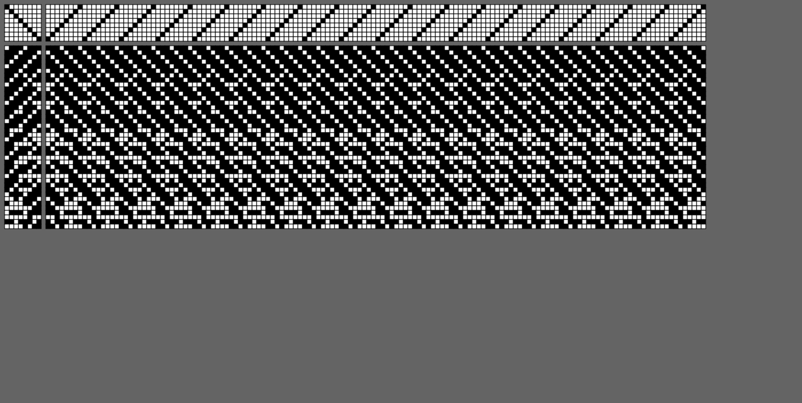

# Generative Weaving

## Algorithmic Glitching

This program generates weaving drafts as svg files based on defined parameters. It takes as input a known weaving pattern, e.g. twill or satin, and glitches the design with increasing frequency. The glitches are shaped by a Perlin noise field which produces deterministic results. Drafts can be modified by panning and zooming around the noise field.

<figure>

<figcaption align = "center"><b>Example output of a generated weaving draft</b></figcaption>
</figure>

## Keyboard Controls

* `s`: save current draft as an svg to the drawdowns folder
* `up arrow`: zoom in, resulting in less variation in the noise field
* `down arrow`: zoom out, resulting in more variation in the noise field
* `left arrow`: pan noise field to the left to adjust the output at the same variation level
* `right arrow`: pan noise field to the right to adjust the output at the same variation level

## Variables

A Perlin noise field is a deterministic structured noise known for organic qualities. The zoom level determines its visible structure.

* `pan`: x-coordinate position on a Perlin nosie
* `pZoom`: zoom level on Perlin noise field
* `seed`: a numerical value for the Perlin noise field

The result is a weaving draft with lift plan, tie ups, threading, and drawdown. The follow are variables that can be edited to control the draft output:

* `numShafts`: the total number of shafts on the loom
* `rectSize`: the size of each cell in the svg output
* `warpQuant`: the total number of warps (or columns)
* `weftQuant`: the total number of wefts (or rows)

The following is generated by the program:

* `liftPlan`: a generated two-dimensional array containing data for the lifted shafts for each row
* `drawdown`: a generated two-dimensional array of the final warps lifted and lowered
* `threading`: a two-dimensional array describing how the shafts are tied up
* `rowFrequency`: analytics on glitch distribution across rows
